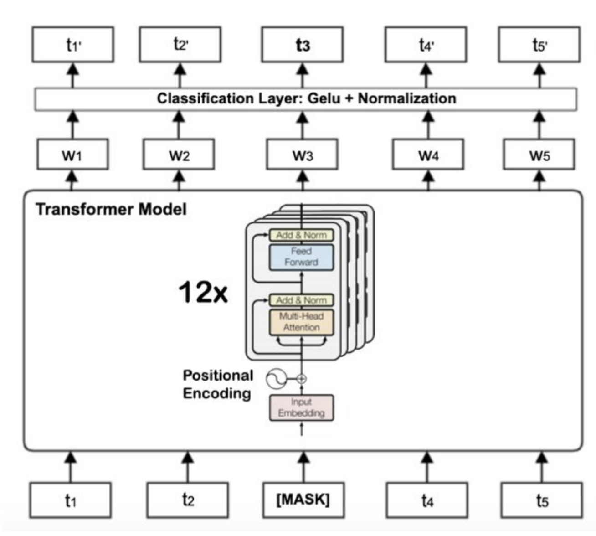
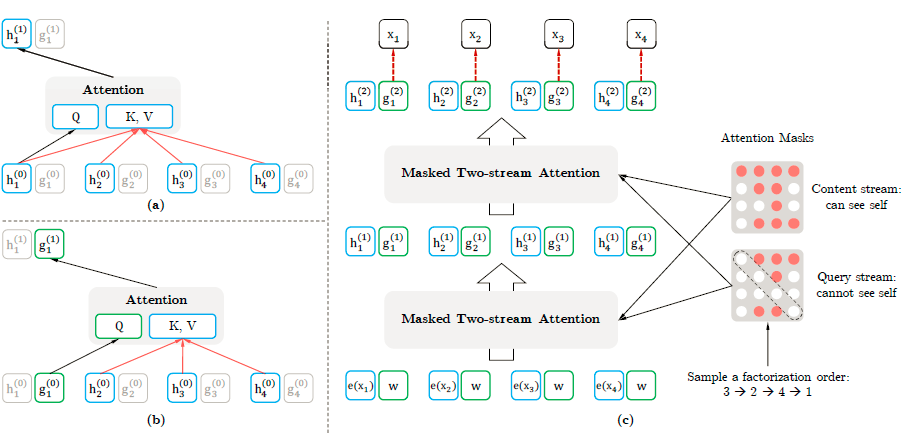

# Methods

### Dataset

The dataset utilized during the sentiment classification procedure is important to the research since it has a substantial impact on classification performance. Given the purpose stated, the dataset must be text with short length relevant to the stock market, as the objective is sentiment analysis of stock market or company analysis. The main sentiment analysis dataset used in this project consists of three parts: Financial PhraseBank, IEEE DataPort and Kaggle tweets dataset. All three datasets are financial related and manually labeled with sentiment scores. In total, the dataset collected for this project has 11,936 financial related text, each with a custom labeled sentiment score in 0 (neutral), 1 (positive) or -1 (negative). Due to the lack of training text in the financial field and the scarcity of manually labeled ones, the collected dataset may be insufficient to train a model with better performance. The raw data should be mapped with sentiment scores across a larger size of tweets to perform sentiment analysis. For sentiment analysis, these sentiment scores are afterwards concatenated into the training dataset. There are several Python libraries that are available, to use to accomplish this type of preprocessing in Natural Language Processing, for example TextBlob and Vader Analyzer. In this project, an open source package called Spacy will be introduced for polarization of larger data sets and be used for training and validation. As a result, we will have 80% of data for training and validation while 20% for testing.

Financial Phrasebank consists of 4,845 English financial headlines that were categorized by sentiment class and were annotated by 16 researchers with a financial background. The sentiment label is either positive, neutral or negative. The dataset is available in four possible configurations, depending on the percentage of agreement of annotators (50%, 66%, 75%, and 100%). In this project, we choose to have the whole Data (at least 50% agreement).
IEEE DataPort (Taborda et al., 2021), dataset can be found here The IEEE DataPort stock market tweets dataset consist of tweets between April 9 and July 16, 2020, using the SP 500 tag (SPX500), the references to the top 25 companies in the SP 500 index, and the Bloomberg tag (stocks). 1,300 out of the 943,672 tweets were manually annotated in positive, neutral, or negative classes. In this project, we will only take the manually labeled data.
Kaggle tweets dataset (Yash Chaudhary, 2020), dataset can be found here Gathered Stock news from Multiple twitter Handles regarding Economic news and custom labeled, which was divided into two parts : Negative(-1) and positive(1). Negative count: 2,106 Positive count: 3,685

### 3.2 Time Series 

In this quarter, we were able to implement LSTM, CNN, and TreNet as three different deep learning models to predict financial time series data. From our progress in this quarter, we are confident that our goals for FinDL are achievable within the given timeframe. We will first focus on conducting research into how we can improve the current implementations of our models and search for other popular and state of the art models to include in our library. Based on the models and improvements we want to implement, we will design the implementation of the library, including the deep learning models, data pre-processing, and feature extraction methods. We will focus on ease of use and straightforward customization of models and fine tuning parameters that is catered towards users in the finance domain. With the design of the library and deep learning models, we will implement all of the models and methods in a finance deep learning library for other users to use in their finance domain machine learning applications.

### 3.3 Tokenizers and Models

Throughout Quarter 1, we have been investing time exploring and studying transformers tokenizers and models. Transformers were first introduced in 2017 and ever since have been revolutionary.
Instead of using RNNs or convolution, transformers adopt a self-attention mechanism that has been proven to be more efficient. Transformers models are built upon seq2seq models that consist of encoders and decoders. Taking a machine translation model for example, the encoder encodes input text and the decoder decodes the outputs from the encoder. NLP models from Transformers are based solely on attention mechanisms in order to draw global dependencies between inputs and outputs. There are apparent benefits of the self-attention mechanism, including learning long range dependencies, yielding more interpretable results, and maximizing the amount of parallelizable computations. For this project, we use a variety of pre-trained models on the Hugging Face platform, particularly on our collected dataset to get more familiar with Transformers and to build stepping stones for Quarter 2. We observe that BERT is the most popular language model on the platform, and many other models are built based on BERT. BERT is a language model pre-trained on Masked LM and Next Sentence Prediction. It is widely used for sentiment analysis, sentence classification and interactive QA. We decided to look further into BERT and understand the various variations of it. In addition to BERT, we fine-tuned several pre-trained models based on other architectures, for example XLNet and GPT2. Upon researching, we discovered that some of the models listed on Hugging Face are specifically designed for financial texts. Combining the models and the Transformers’ architecture, we aim to try out this new approach towards sentiment analysis for our Quarter 1 Project.

### 3.4 Pre-train Model Approach

For this project, we chose to fine-tune on the pretrained models provided by Hugging Face, which consists of three major steps when designing:

* Choose a source model: From the available models, a pre-trained source model is picked.
* Over the years, many teams and researchers trained models based on vast and difficult
* datasets, while Hugging Face collected most of them with easy to use APIs. Thus, we can
* easily find ideal models from Hugging Face hub based on our task.

* Model for Reuse: The pre-trained model can then be utilized to build a model for the second
* job of interest, in this case, we can use them for financial sentiment analysis. Depending
* on the modeling technique employed, this may entail using all or sections of the model.

* Fine-tuned: On the input-output pair data available for the job of interest, the model may
* need to be altered or refined, in this project, we will continue the training using our collected
* data and alter some hyperparameters.

### 3.5 Model Details

#### 3.5.1 BERT

The use of a pre-trained model is prevalent. BERT and XLNet, and other models are examples of this type. There are numerous advantages of employing transfer learning. Higher start, high rate of skill increase, and superior converged skill are a few of them (Dussa, 2020). Bidirectional Transformer Encoder Representations (BERT) is a bidirectional encoder transformer paradigm. This model was created to help Google AI Language pre-train deep bidirectional representations to extract context-sensitive properties from input text (Devlin et al., 2018). BERT learns contextual relationships between words in a text via an attention mechanism in the transformer. Transformer is made up of two mechanisms: an encoder that reads the text input and a decoder that generates the task prediction.

#### 3.5.2 XLNet

XLNet is a language model proposed by researchers from Google AI Brain Team and Carnegie Mellon University (Yang et al.,2019) that learns unsupervised representations of text sequences using a generalized autoregressive language model. BERT masks the words, presuming that the masked words have nothing in common. The interdependence of the disguised words is not considered. The XLNet system can overcome this disadvantage. XLNet employs the permutational language modeling technique. In order to cover both forward and backward directions, XLNet evaluates all potential permutations. Simply put, XLNet maintains the original sequence order, employs positional encodings, and employs a specific attention mask in Transformers to achieve the aforementioned factorization order permutation. To keep track of anticipated words and consider them in the next token prediction, XLNet employs a two-stream self-attention technique.

### 3.6 Implementation

The dataset was collected through three sources: Financial PhraseBank, IEEE DataPort and Kaggle tweets dataset. The features of the training data consists of financial text and the labels are either 0(neutral), 1(positive) or -1(negative). 11,936 samples were collected, and the training process is efficient with less time cost. Additionally, a pipeline for training multiple transformers was deployed on 1 NVIDIA 2080ti GPU. We tokenize our inputs using AutoTokenizer provided by Transformers on the pre-trained FinBERT model. While tokenizing, we pad the inputs according to the maximum length in the dataset to ensure that the vectors are of the same dimensions. FinBERT is a project brought out by Prosus that was fine-tuned on BERT specifically for financial text in 2019. Compared with the traditional BERT language model, FinBERT performs much better on financial text. Our training set consists of the FinancialPhraseBank, which was originally used to develop FinBERT, and the dataset of similar format. We use the Trainer provided by Transformers to train our model.
Upon training, we have discovered that there are many ways we can fine-tune the already fine-tuned FinBERT model. We believe that we can achieve a better performance if we adjust the parameters specifically for stock information text.

### 3.7 Polarity Assignment and Target Dataset - Spacy

In order to run the package in real-time, a data generation pipeline had to be set up so current data could easily be pulled into the model for evaluation as well as building a target dataset for our final objective, capture market trend. The easiest way to do this was to use the internet’s town square, Twitter. When a user inputs a certain stock into the model, e.g. AAPL, we used the Twitter API to go and grab the latest tweets containing the keyword “AAPL”, and send those to the model for classification. The only issue with this is that the data looks slightly different from training data, and to create a bit more training data as well as a new validation dataset on these tweets can be beneficial for a better performance. That is where the Spacy model comes in.

A Spacy model was fine-tuned in order to speed up the process of creating more training and validation data where sentiment could be generated automatically and then manually checked by a human.

This speeds up creating new training data as the majority are already correct when generated and only few here and there need to be changed. For this project, the last 10000 tweets related with the five technology giants that dominate the SP 500 index was scraped and labeled with Spacy for training and testing purposes, they are Apple (ticker AAPL), Microsoft (MSFT), Alphabet (GOOG), Amazon.com (AMZN), and Facebook (FB).

### 3.8 Future Focus

During Quarter 2, our first objective is to try out more models on HuggingFace to get a better
understanding of how different language models work in general. We would like to fine-tune them and eventually figure out what the best model is for our dataset. Then we would like to obtain more training data, preferably from real-time sources. By obtaining more data, we hope to further improve our accuracy on the sentiment analysis task. Finally, we would like to try to build our own language model for stock text, likely on top of BERT. Even though FinBERT has performed relatively well on financial textual data, we believe that a language model that is specifically built for stock textual data would better fit our goal. We aim to integrate our sentiment analysis method into the library that we will deliver at the end of Quarter 2. We would like to provide a model that is easy to understand and also user-friendly.

