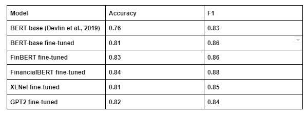

# Results

The following table presents the sentiment analysis results in a classification report on the test set. Although our fine-tuned models did not significantly outperform common baselines, the BERT-base (Devlin et al., 2019), they still achieved decent results. Our models achieved better performance than the state-of-the-art model for general tasks on testing dataset, which demonstrates its effectiveness in financial sentiment analysis.

